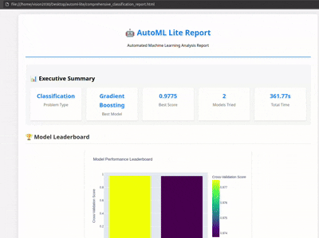
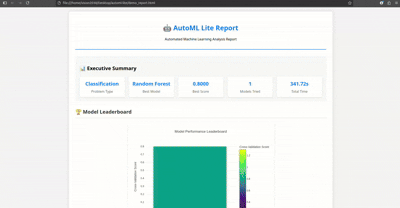
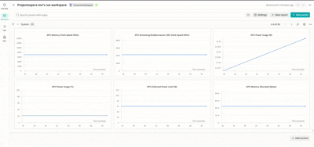

# AutoML Lite 🤖

**Automated Machine Learning Made Simple**

[](https://badge.fury.io/py/automl-lite)
[](https://www.python.org/downloads/)
[](LICENSE)
[]()

A lightweight, production-ready automated machine learning library that simplifies the entire ML pipeline from data preprocessing to model deployment.

## 🎬 Demo

### AutoML Lite in Action


### Generated HTML Report


### Comprehensive AutoML Report


### Weights & Biases Integration


## 📋 Table of Contents

- [Features](#-features)
- [Installation](#-installation)
- [Quick Start](#-quick-start)
- [CLI Commands](#-cli-commands)
- [Python API](#-python-api)
- [Advanced Features](#-advanced-features)
- [Use Cases](#-use-cases)
- [Examples](#-examples)
- [Configuration](#-configuration)
- [Contributing](#-contributing)
- [License](#-license)

## ✨ Features

### 🎯 Core Features
- **Automated Model Selection**: Tests multiple algorithms and selects the best performer
- **Hyperparameter Optimization**: Uses Optuna for efficient parameter tuning
- **Cross-Validation**: Robust model evaluation with customizable folds
- **Feature Engineering**: Automatic preprocessing and feature selection
- **Model Persistence**: Save and load trained models easily

### 🚀 Advanced Features
- **Ensemble Methods**: Automatic ensemble creation with voting classifiers
- **Early Stopping**: Optimized training with patience and early stopping
- **Feature Selection**: Intelligent feature importance and selection
- **Model Interpretability**: SHAP values and feature effects analysis
- **Comprehensive Reporting**: HTML reports with interactive visualizations

### 🛠️ Production Ready
- **CLI Interface**: Complete command-line interface
- **Error Handling**: Robust error handling and fallback mechanisms
- **Logging**: Comprehensive logging for debugging
- **Type Hints**: Full type annotations for better development experience

### 🏭 Production-Ready Features
- **Auto Feature Engineering**: Automatic generation of polynomial, interaction, temporal, and domain-specific features
- **Advanced Interpretability**: Multi-method interpretability with SHAP, LIME, permutation importance, and partial dependence plots
- **Configuration Management**: YAML/JSON configuration system with templates for different use cases
- **Experiment Tracking**: Integration with MLflow, Weights & Biases, TensorBoard, and local tracking
- **Time Series Support**: ARIMA, Prophet, and LSTM models for forecasting tasks
- **Deep Learning**: TensorFlow and PyTorch integration for neural networks and transfer learning
- **Interactive Dashboards**: Real-time monitoring and visualization with Streamlit

## 🚀 Installation

### Prerequisites
- Python 3.8 or higher
- pip package manager

### Install from Source
```bash
# Clone the repository
git clone https://github.com/Sherin-SEF-AI/AutoML-Lite.git
cd AutoML-Lite

# Create virtual environment
python -m venv venv
source venv/bin/activate  # On Windows: venv\Scripts\activate

# Install dependencies
pip install -r requirements.txt

# Install the package
pip install -e .
```

### Dependencies
The package automatically installs all required dependencies:
- scikit-learn
- pandas
- numpy
- optuna
- plotly
- seaborn
- matplotlib
- jinja2
- joblib

## 🚀 Quick Start

### Using CLI (Recommended for Beginners)

1. **Train a Model**
```bash
python -m automl_lite.cli.main train data.csv --target target_column --output model.pkl
```

2. **Make Predictions**
```bash
python -m automl_lite.cli.main predict model.pkl test_data.csv --output predictions.csv
```

3. **Generate Report**
```bash
python -m automl_lite.cli.main report model.pkl --output report.html
```

### Using Python API

```python
from automl_lite import AutoMLite
import pandas as pd

# Load data
data = pd.read_csv('data.csv')

# Initialize AutoML
automl = AutoMLite(
    problem_type='classification',
    enable_ensemble=True,
    enable_feature_selection=True,
    enable_interpretability=True
)

# Train model
automl.fit(data, target_column='target')

# Make predictions
predictions = automl.predict(test_data)

# Generate report
automl.generate_report('report.html')

# Save model
automl.save_model('model.pkl')
```

## 📖 CLI Commands

### Training Command

```bash
python -m automl_lite.cli.main train [OPTIONS] DATA
```

**Arguments:**
- `DATA`: Path to training data file (CSV format)

**Options:**
- `--target TEXT`: Target column name (required)
- `--output PATH`: Output model file path (default: model.pkl)
- `--config PATH`: Configuration file path
- `--time-budget INTEGER`: Time budget in seconds (default: 300)
- `--max-models INTEGER`: Maximum number of models (default: 10)
- `--cv-folds INTEGER`: Cross-validation folds (default: 5)
- `--enable-ensemble`: Enable ensemble methods
- `--enable-feature-selection`: Enable feature selection
- `--enable-interpretability`: Enable model interpretability
- `--verbose`: Verbose output

**Examples:**
```bash
# Basic training
python -m automl_lite.cli.main train iris.csv --target species --output iris_model.pkl

# Advanced training with all features
python -m automl_lite.cli.main train data.csv --target target --output model.pkl \
    --enable-ensemble --enable-feature-selection --enable-interpretability \
    --time-budget 600 --max-models 15 --verbose
```

### Prediction Command

```bash
python -m automl_lite.cli.main predict [OPTIONS] MODEL DATA
```

**Arguments:**
- `MODEL`: Path to trained model file
- `DATA`: Path to prediction data file

**Options:**
- `--output PATH`: Output predictions file path (default: predictions.csv)
- `--proba`: Output prediction probabilities

**Examples:**
```bash
# Regular predictions
python -m automl_lite.cli.main predict model.pkl test_data.csv --output predictions.csv

# Probability predictions
python -m automl_lite.cli.main predict model.pkl test_data.csv --output probabilities.csv --proba
```

### Report Command

```bash
python -m automl_lite.cli.main report [OPTIONS] MODEL
```

**Arguments:**
- `MODEL`: Path to trained model file

**Options:**
- `--output PATH`: Output report file path (default: report.html)

**Examples:**
```bash
python -m automl_lite.cli.main report model.pkl --output comprehensive_report.html
```

### Interactive Mode

```bash
python -m automl_lite.cli.main interactive
```

Launches an interactive session for guided model training and analysis.

## 🐍 Python API

### AutoMLite Class

The main class for automated machine learning.

```python
from automl_lite import AutoMLite

automl = AutoMLite(
    problem_type='classification',  # or 'regression'
    time_budget=300,
    max_models=10,
    cv_folds=5,
    enable_ensemble=True,
    enable_feature_selection=True,
    enable_interpretability=True,
    random_state=42
)
```

### Methods

#### `fit(X, y=None, target_column=None)`
Train the AutoML model.

```python
# Using DataFrame with target column
automl.fit(data, target_column='target')

# Using separate X and y
automl.fit(X, y)
```

#### `predict(X)`
Make predictions on new data.

```python
predictions = automl.predict(test_data)
```

#### `predict_proba(X)`
Get prediction probabilities (classification only).

```python
probabilities = automl.predict_proba(test_data)
```

#### `save_model(path)`
Save the trained model.

```python
automl.save_model('model.pkl')
```

#### `load_model(path)`
Load a saved model.

```python
automl.load_model('model.pkl')
```

#### `generate_report(path)`
Generate comprehensive HTML report.

```python
automl.generate_report('report.html')
```

#### `get_leaderboard()`
Get model performance leaderboard.

```python
leaderboard = automl.get_leaderboard()
```

#### `get_feature_importance()`
Get feature importance scores.

```python
importance = automl.get_feature_importance()
```

## 🚀 Advanced Features

### Ensemble Methods

AutoML Lite automatically creates ensemble models by combining the best performing models:

```python
automl = AutoMLite(enable_ensemble=True)
automl.fit(data, target_column='target')

# The ensemble model is automatically created and used for predictions
predictions = automl.predict(test_data)
```

**Features:**
- Automatic detection of `predict_proba` support
- Soft voting for compatible models
- Hard voting fallback for incompatible models
- Top-K model selection

### Feature Selection

Intelligent feature selection based on importance scores:

```python
automl = AutoMLite(enable_feature_selection=True)
automl.fit(data, target_column='target')

# Get selected features
selected_features = automl.selected_features
print(f"Selected {len(selected_features)} features out of {len(data.columns)}")
```

### Model Interpretability

Comprehensive model interpretability using SHAP values:

```python
automl = AutoMLite(enable_interpretability=True)
automl.fit(data, target_column='target')

# Get interpretability results
interpretability = automl.get_interpretability_results()
```

**Available Interpretability Features:**
- SHAP values for feature importance
- Feature effects analysis
- Model complexity metrics
- Individual prediction explanations

### Early Stopping

Optimized training with early stopping:

```python
automl = AutoMLite(
    enable_early_stopping=True,
    patience=10,
    min_delta=0.001
)
```

## 🏭 Production-Ready Features

### Auto Feature Engineering
Automatically generate advanced features to improve model performance:

```python
# Enable auto feature engineering
automl = AutoMLite(
    enable_auto_feature_engineering=True,
    # Features generated: polynomial, interaction, temporal, statistical, domain-specific
)

# Get feature engineering summary
summary = automl.get_feature_engineering_summary()
print(f"Generated {summary['engineered_features']} new features")
```

### Advanced Interpretability
Multi-method interpretability for comprehensive model understanding:

```python
# Enable advanced interpretability
automl = AutoMLite(
    enable_interpretability=True,
    # Methods: SHAP, LIME, permutation importance, partial dependence
)

# Get interpretability results
results = automl.get_interpretability_report()
print(f"SHAP available: {results['shap_available']}")
print(f"LIME available: {results['lime_available']}")
```

### Configuration Management
Use YAML/JSON configurations with built-in templates:

```python
from automl_lite.config.advanced_config import ConfigManager, AutoMLConfig

# Load configuration manager
config_manager = ConfigManager()

# List available templates
templates = config_manager.list_templates()
print(f"Available templates: {templates}")

# Load production template
config = config_manager.get_template('production')

# Use configuration
automl = AutoMLite(config=config)
```

### Experiment Tracking
Track experiments with multiple backends:

```python
from automl_lite.experiments.tracker import ExperimentTracker

# Initialize experiment tracker
tracker = ExperimentTracker(
    tracking_backend="mlflow",  # or "wandb", "tensorboard", "local"
    experiment_name="my_experiment"
)

# Use with AutoML
automl = AutoMLite(
    enable_experiment_tracking=True,
    experiment_tracker=tracker
)
```

### Time Series Support
Forecast time series data with multiple models:

```python
# Enable time series forecasting
automl = AutoMLite(
    enable_time_series=True,
    # Models: ARIMA, Prophet, LSTM
)

# Get time series summary
summary = automl.get_time_series_summary()
print(f"Best model: {summary['best_model']}")
```

### Deep Learning
Integrate neural networks and transfer learning:

```python
# Enable deep learning
automl = AutoMLite(
    enable_deep_learning=True,
    # Frameworks: TensorFlow, PyTorch
)

# Get deep learning summary
summary = automl.get_deep_learning_summary()
print(f"Framework: {summary['framework']}")
print(f"Model type: {summary['model_type']}")
```

### Interactive Dashboards
Real-time monitoring with Streamlit:

```python
# Run interactive dashboard
automl.run_dashboard()

# Or run separately
# streamlit run src/automl_lite/ui/interactive_dashboard.py
```

## 📊 Use Cases

### 1. Classification Problems

**Customer Churn Prediction**
```python
# Load customer data
customer_data = pd.read_csv('customer_data.csv')

# Train model
automl = AutoMLite(problem_type='classification', enable_ensemble=True)
automl.fit(customer_data, target_column='churned')

# Predict churn probability
churn_prob = automl.predict_proba(new_customers)
```

**Spam Detection**
```python
# Email classification
automl = AutoMLite(
    problem_type='classification',
    enable_feature_selection=True,
    enable_interpretability=True
)
automl.fit(email_data, target_column='is_spam')

# Generate report for analysis
automl.generate_report('spam_detection_report.html')
```

### 2. Regression Problems

**House Price Prediction**
```python
# Real estate data
automl = AutoMLite(
    problem_type='regression',
    enable_ensemble=True,
    time_budget=600
)
automl.fit(house_data, target_column='price')

# Predict house prices
predictions = automl.predict(new_houses)
```

**Sales Forecasting**
```python
# Time series forecasting
automl = AutoMLite(
    problem_type='regression',
    enable_feature_selection=True
)
automl.fit(sales_data, target_column='sales_volume')
```

### 3. Production Deployment

**Batch Processing**
```bash
# Train model
python -m automl_lite.cli.main train historical_data.csv --target target --output production_model.pkl

# Batch predictions
python -m automl_lite.cli.main predict production_model.pkl new_data.csv --output batch_predictions.csv
```

**API Integration**
```python
# Load trained model
automl = AutoMLite()
automl.load_model('production_model.pkl')

# API endpoint
def predict_endpoint(data):
    return automl.predict(data)
```

## 📚 Examples

### Basic Classification Example

```python
from automl_lite import AutoMLite
import pandas as pd
from sklearn.datasets import load_iris

# Load iris dataset
iris = load_iris()
data = pd.DataFrame(iris.data, columns=iris.feature_names)
data['target'] = iris.target

# Initialize AutoML
automl = AutoMLite(
    problem_type='classification',
    time_budget=60,
    max_models=5
)

# Train model
automl.fit(data, target_column='target')

# Make predictions
predictions = automl.predict(data.iloc[:10])

# Generate report
automl.generate_report('iris_report.html')

print(f"Best model: {automl.best_model_name}")
print(f"Best score: {automl.best_score:.4f}")
```

### Advanced Regression Example

```python
from automl_lite import AutoMLite
import pandas as pd
from sklearn.datasets import load_boston

# Load boston housing dataset
boston = load_boston()
data = pd.DataFrame(boston.data, columns=boston.feature_names)
data['target'] = boston.target

# Initialize AutoML with all features
automl = AutoMLite(
    problem_type='regression',
    enable_ensemble=True,
    enable_feature_selection=True,
    enable_interpretability=True,
    time_budget=300,
    max_models=10
)

# Train model
automl.fit(data, target_column='target')

# Get feature importance
importance = automl.get_feature_importance()
print("Top 5 features:")
for feature, score in list(importance.items())[:5]:
    print(f"{feature}: {score:.4f}")

# Generate comprehensive report
automl.generate_report('boston_housing_report.html')
```

### CLI Workflow Example

```bash
# 1. Train model with all features
python -m automl_lite.cli.main train customer_data.csv \
    --target churn \
    --output customer_churn_model.pkl \
    --enable-ensemble \
    --enable-feature-selection \
    --enable-interpretability \
    --time-budget 600 \
    --max-models 15 \
    --verbose

# 2. Generate comprehensive report
python -m automl_lite.cli.main report customer_churn_model.pkl \
    --output customer_churn_report.html

# 3. Make predictions on new data
python -m automl_lite.cli.main predict customer_churn_model.pkl \
    new_customers.csv \
    --output churn_predictions.csv \
    --proba
```

## ⚙️ Configuration

### Configuration File

Create a `config.yaml` file for custom settings:

```yaml
# AutoML Configuration
problem_type: classification
time_budget: 600
max_models: 15
cv_folds: 5
random_state: 42

# Advanced Features
enable_ensemble: true
enable_feature_selection: true
enable_interpretability: true
enable_early_stopping: true

# Model Parameters
models:
  - RandomForest
  - XGBoost
  - LightGBM
  - SVM
  - NeuralNetwork

# Feature Selection
feature_selection:
  method: mutual_info
  threshold: 0.01
  max_features: 20

# Ensemble
ensemble:
  method: voting
  top_k: 3
  voting: soft
```

### Using Configuration

```bash
python -m automl_lite.cli.main train data.csv --target target --config config.yaml
```

```python
automl = AutoMLite.from_config('config.yaml')
automl.fit(data, target_column='target')
```

## 📊 Supported Algorithms

### Classification
- Random Forest
- XGBoost
- LightGBM
- Support Vector Machine (SVM)
- Logistic Regression
- Naive Bayes
- Neural Network (MLP)
- Extra Trees
- Linear Discriminant Analysis

### Regression
- Random Forest
- XGBoost
- LightGBM
- Support Vector Regression (SVR)
- Linear Regression
- Ridge Regression
- Lasso Regression
- Neural Network (MLP)
- Extra Trees

## 📈 Performance Metrics

### Classification Metrics
- Accuracy
- Precision
- Recall
- F1-Score
- ROC-AUC
- Precision-Recall AUC

### Regression Metrics
- R² Score
- Mean Absolute Error (MAE)
- Mean Squared Error (MSE)
- Root Mean Squared Error (RMSE)

## 🔧 Troubleshooting

### Common Issues

**1. Memory Issues**
```bash
# Reduce number of models
python -m automl_lite.cli.main train data.csv --target target --max-models 5
```

**2. Time Budget Exceeded**
```bash
# Increase time budget
python -m automl_lite.cli.main train data.csv --target target --time-budget 1200
```

**3. Model Compatibility**
```python
# Check model support
automl = AutoMLite(enable_ensemble=False)  # Disable ensemble if issues occur
```

**4. Feature Selection Issues**
```python
# Disable feature selection for debugging
automl = AutoMLite(enable_feature_selection=False)
```

### Debug Mode

Enable verbose logging for debugging:

```bash
python -m automl_lite.cli.main train data.csv --target target --verbose
```

## 🤝 Contributing

We welcome contributions! Please see our [Contributing Guidelines](CONTRIBUTING.md) for details.

### Development Setup

```bash
# Clone repository
git clone https://github.com/Sherin-SEF-AI/AutoML-Lite.git
cd AutoML-Lite

# Install development dependencies
pip install -r requirements-dev.txt

# Run tests
pytest tests/

# Run linting
flake8 src/
black src/
```

## 📄 License

This project is licensed under the MIT License - see the [LICENSE](LICENSE) file for details.

## 👨‍💻 Author

**Sherin Joseph Roy**
- Email: sherin.joseph2217@gmail.com
- GitHub: [@Sherin-SEF-AI](https://github.com/Sherin-SEF-AI)

## 🙏 Acknowledgments

- [scikit-learn](https://scikit-learn.org/) for the machine learning algorithms
- [Optuna](https://optuna.org/) for hyperparameter optimization
- [Plotly](https://plotly.com/) for interactive visualizations
- [Pandas](https://pandas.pydata.org/) for data manipulation

## 📞 Support

- **Issues**: [GitHub Issues](https://github.com/Sherin-SEF-AI/AutoML-Lite/issues)
- **Email**: sherin.joseph2217@gmail.com
- **Documentation**: [GitHub Wiki](https://github.com/Sherin-SEF-AI/AutoML-Lite/wiki)

---

**Made with ❤️ by Sherin Joseph Roy** 